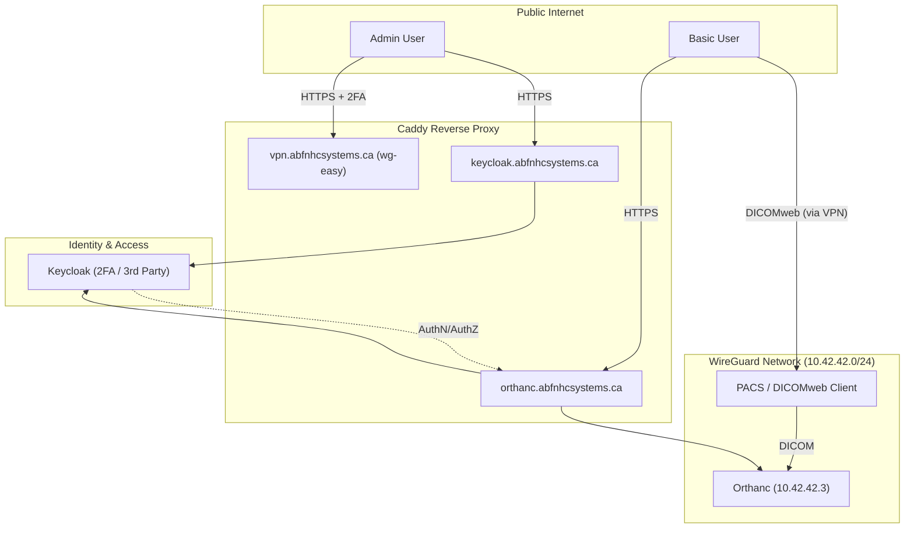

# PHI Data Flows
[Home](README.md) | [Overview](system-overview.md) | [Data Flows](data-flows.md) | [Security Controls](security-controls.md) | [Risk Register](risk-register.md) | [Future Work](future-work.md)

## High-Level Architecture

## Narrative
- **Admin Access**: Admins connect to the WireGuard VPN (wg-easy) using 2FA. Once connected, they manage VPN profiles and configure user accounts/roles within Keycloak.
- **Basic User - DICOMweb**: Clinical users or automated systems send DICOM data via the DICOMweb protocol. This requires an active WireGuard VPN connection to ensure PHI is encrypted in transit and the Orthanc endpoints are reachable.
- **Basic User - Web UI**: Users access the Orthanc UI (Explorer 2 / OHIF) via HTTPS at `orthanc.abfnhcsystems.ca`. Authentication is delegated to Keycloak, which requires either a 3rd-party identity provider or a username/password with 2FA. Orthanc serves as the backend for this endpoint.
- **Internal DNS**: `dnsmasq` maps names within the WG network, simplifying PACS → Orthanc routing.

## Data Retention Locations
- Orthanc: Postgres + object storage backend (per compose env), persists DICOM and metadata

## External Dependencies
- DNS and TLS issuance for public domains managed by Caddy and upstream DNS providers
- Host OS and Docker security posture
