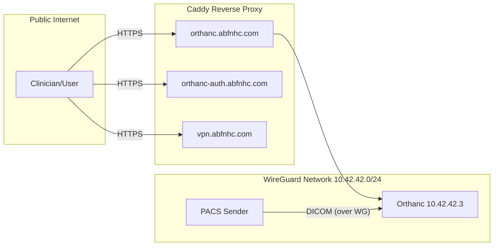

# PHI Data Flows
[Home](README.md) | [Overview](system-overview.md) | [Data Flows](data-flows.md) | [Security Controls](security-controls.md) | [Risk Register](risk-register.md) | [Future Work](future-work.md)

## High-Level Architecture

## Narrative
- DICOM ingress: External PACS sends DICOM over the WireGuard VPN into Orthanc at 10.42.42.3. Default configuration suggests DICOM TLS is disabled; therefore VPN is the confidentiality layer for PHI-in-transit.
- User access: Users access Orthanc UI via HTTPS through Caddy. Orthanc Explorer 2 integrates with Keycloak for SSO, and authorization is enforced via `orthanc-auth-service`.
- Internal DNS: `dnsmasq` maps names within the WG network, simplifying PACS → Orthanc routing.

## Data Retention Locations
- Orthanc: Postgres + object storage backend (per compose env), persists DICOM and metadata

## External Dependencies
- DNS and TLS issuance for public domains managed by Caddy and upstream DNS providers
- Host OS and Docker security posture